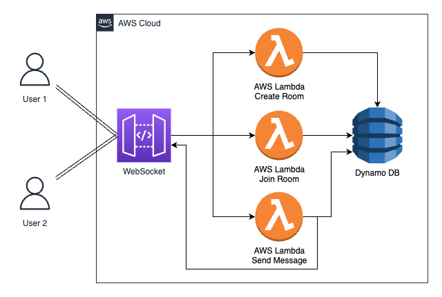

# Live Chat WebSockets Project



Welcome to the Live Chat WebSockets project! In this project, you'll learn how to build a real-time chat application using WebSockets. WebSockets enable seamless communication between clients and servers, making it perfect for applications like chat rooms. Whether you're a beginner or experienced developer, this project will guide you through the process of creating a dynamic and interactive chat platform.

## Table of Contents
- [Introduction](#introduction)
- [Architecture](#architecture)
- [Getting Started](#getting-started)
- [Message Types](#message-types)
- [Creating and Joining Rooms](#creating-and-joining-rooms)
- [Sending and Receiving Messages](#sending-and-receiving-messages)
- [Handling Disconnections](#handling-disconnections)
- [Setup and Deployment](#setup-and-deployment)
- [Testing WebSocket](#testing-websocket)
- [Conclusion](#conclusion)

## Introduction
The Live Chat WebSockets project empowers you to develop a real-time chat application where users can communicate instantly within custom chat rooms. Unlike traditional APIs, WebSockets maintain persistent connections, allowing for seamless bidirectional communication. This project will guide you through creating, joining, and interacting in chat rooms using different message types.

## Architecture


Our project architecture leverages AWS services such as AWS Lambda, DynamoDB, and API Gateway to create a scalable and reliable chat application. The WebSockets API Gateway handles WebSocket connections, while AWS Lambda functions manage room creation, user joining, message handling, and disconnection events. DynamoDB serves as the database to store room and user information.

## Getting Started
To get started with the project, follow these steps:
1. Clone this repository.
2. Set up the necessary AWS services (Lambda, DynamoDB, API Gateway).
3. Deploy the Lambda functions provided in the repository.
4. Configure the API Gateway for WebSocket support.
5. Update the necessary configuration files with your AWS credentials.
6. Run the client-side application on your local machine.

## Message Types
The project uses various message types to facilitate communication:
- `joinRoom`: Custom message type for a user to join an existing room.
- `createRoom`: Custom message type for creating a new room.
- `sendMessage`: Custom message type to send messages within a room.
- `$disconnect`: Default message type indicating a user's disconnection.

## Creating and Joining Rooms
Users can create new rooms or join existing ones. The backend Lambda functions ensure the creation and validation of rooms. Before joining, the system verifies if the room exists based on the roomId provided.

## Sending and Receiving Messages
Once users are in a room, they can send and receive messages using the `sendMessage` message type. The WebSocket connection facilitates instant delivery of messages to all users within the room.

## Handling Disconnections
The `$disconnect` message type helps manage user disconnections. A simple Lambda function removes the user's record from DynamoDB, ensuring the chat room remains updated with the latest user list.

## Setup and Deployment
1. Follow the detailed setup instructions provided in the `setup.md` file.
2. Deploy the AWS Lambda functions using the deployment scripts provided.
3. Configure API Gateway to support WebSocket connections.
4. Update the client-side application configuration with the WebSocket endpoint.
5. Deploy the client-side application to a hosting platform.

### Using SAM Template for Deployment
To streamline the deployment process, we provide a Serverless Application Model (SAM) template. Follow these steps to deploy your project:

1. Open a terminal and navigate to the root directory of your project.
2. Build your SAM application:
    ```
    sam build
    ```
3. Deploy the application using SAM's guided deployment:
    ```
    sam deploy --guided --capabilities CAPABILITY_NAMED_IAM
    ```
4. When prompted, provide the following deployment arguments:
    - **Stack Name**: Enter a name for your CloudFormation stack (e.g., `ChatApp`).
    - **AWS Region**: Enter the AWS region where you want to deploy the application.
    - **Allow SAM CLI IAM role creation**: Confirm with `Y` to allow SAM CLI to create roles for resource connection.
    - **Disable rollback**: Confirm with `N` to enable rollback on failed deployments.
    - **Save arguments to configuration file**: Confirm with `Y` to save the deployment arguments.

## Testing WebSocket
To test your WebSocket implementation, use the [WebSocket Tester](https://www.piesocket.com/websocket-tester) tool. This will help you ensure that your chat application works seamlessly with WebSockets.

## Conclusion
Congratulations! You've successfully built a real-time chat application using WebSockets. This project has equipped you with the knowledge to create, join, and communicate within chat rooms effectively. Feel free to customize and expand the project further, adding features like user authentication, message history, and multimedia sharing. Happy coding!

**Note:** This README provides a high-level overview of the project. For detailed instructions, code snippets, and images, refer to the project repository's documentation.

**Disclaimer:** Images used in this README are for illustrative purposes only. Actual implementation may vary.
